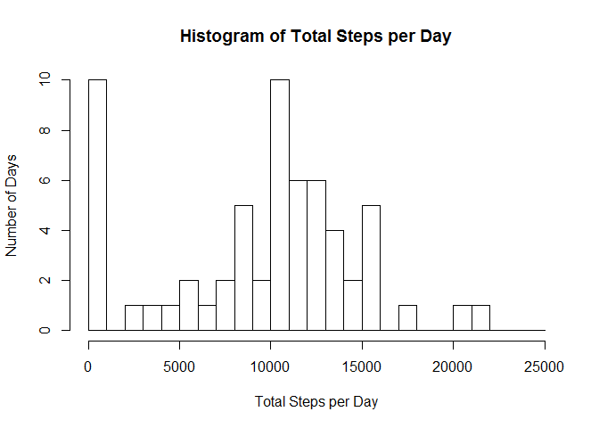
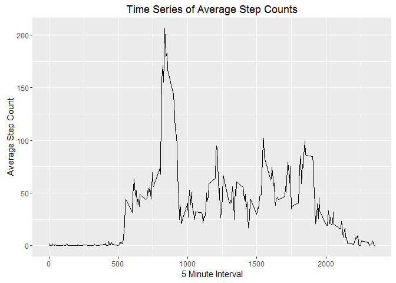
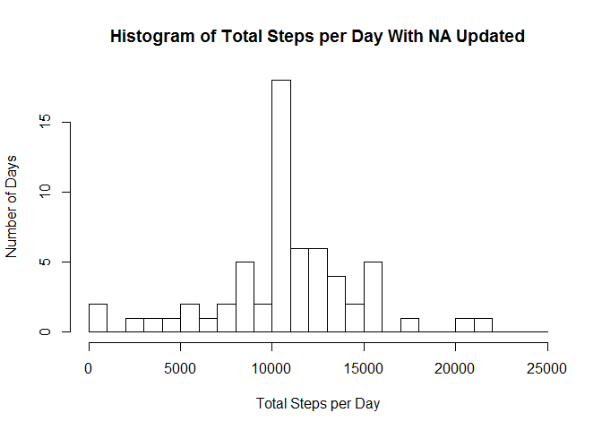
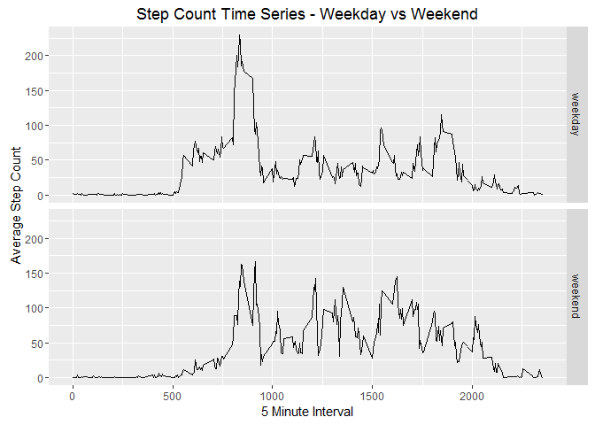

# Reproducible Research: Peer Assessment 1
Author: Rod Slagle  

## Loading and preprocessing the data

```r
knitr::opts_chunk$set(fig.path='figures/', echo=TRUE)

unzip(zipfile="activity.zip")
activity <- read.csv("activity.csv")
```

## What is mean total number of steps taken per day?

```r
# Sum Steps per day
totalStepsPerDay <- tapply(activity$steps, activity$date, FUN=sum, na.rm=TRUE)

# Histogram of Total Steps per Day
hist(totalStepsPerDay, breaks=seq(0, 25000, by=1000), main="Histogram of Total Steps per Day", xlab="Total Steps per Day", ylab="Number of Days")
```

<!-- -->

```r
# Mean of Total Steps per Day
mean(totalStepsPerDay)
```

```
## [1] 9354.23
```

```r
# Median of Total Steps per Day
median(totalStepsPerDay)
```

```
## [1] 10395
```

## What is the average daily activity pattern?


```r
# Calculate Avg. Interval Step Count
averageIntervalStepCount <- aggregate(x=list(steps=activity$steps), by=list(interval=activity$interval), FUN=mean, na.rm=TRUE)

library(ggplot2)
```

```
## Warning: package 'ggplot2' was built under R version 3.3.1
```

```r
# Plot Time Series of Avg. Step Counts
ggplot(averageIntervalStepCount, aes(x=interval, y=steps)) + 
    geom_line() + 
    ggtitle("Time Series of Average Step Counts") +
    xlab("5 Minute Interval") +
    ylab("Average Step Count")
```

<!-- -->

What Interval has the Maximum Average Step Count?


```r
# Interval with Max Average Step Count
averageIntervalStepCount[which(max(averageIntervalStepCount$steps)==averageIntervalStepCount$steps),]
```

```
##     interval    steps
## 104      835 206.1698
```

## Imputing missing values


```r
# Number of Rows with Missing Values
nrow(activity[is.na(activity$steps),])
```

```
## [1] 2304
```

Data with Missing Step Counts will be updated/replaced with the average step count for the specific Interval across all Dates.  To do this the orginal dataset is split in two (Valid Step Data and Missing Step Data).  The  missing step date is updated from the average interval data.  Then the Valid data is again joined with the updated "missing" data.

```r
# Update Missing Values

# Subset Non-Missing Data
validStepCounts <- activity[!is.na(activity$steps),]
# Subset Missing Data
missingStepCounts <- activity[is.na(activity$steps),c("date","interval")]

# Update Missing Values with Average Interval Counts
missingCountsUpdated <- merge (missingStepCounts, averageIntervalStepCount)

# Combine Non-Missing Data with Updated Missing Data
activityUpdated <- rbind(validStepCounts, missingCountsUpdated)
```

Histogram of Updated Data

```r
# Calculate Updated Averages
totalStepsPerDayUpdated <- tapply(activityUpdated$steps, activityUpdated$date, FUN=sum, na.rm=TRUE)

# Histogram of Total Steps per Day Updated
hist(totalStepsPerDayUpdated, breaks=seq(0, 25000, by=1000), main="Histogram of Total Steps per Day With NA Updated", xlab="Total Steps per Day", ylab="Number of Days")
```

<!-- -->


```r
# Mean of Total Steps per Day Updated
mean(totalStepsPerDayUpdated)
```

```
## [1] 10766.19
```

```r
# Median of Total Steps per Day Updated
median(totalStepsPerDayUpdated)
```

```
## [1] 10766.19
```

In addition to the above Histogram, we can calculate the difference of the Means and Medians between the Original and Updated Data.

```r
# Difference between Orig. Mean and Updated Mean
mean(totalStepsPerDay) - mean(totalStepsPerDayUpdated)
```

```
## [1] -1411.959
```

```r
# Difference between Orig. Median and Updated Median
median(totalStepsPerDay) - median(totalStepsPerDayUpdated)
```

```
## [1] -371.1887
```

## Are there differences in activity patterns between weekdays and weekends?
To do this analysis we first create a new variable that categorizes the day of the week into "weekday" and "weekend". 

```r
# Using Data with Updated Missing Values
activityUpdated$weekdayGroup <- ifelse(weekdays(as.Date(activityUpdated$date)) %in%  c("Saturday","Sunday") ,"weekend", "weekday")
```

A Panel Plot is generated to visulize the difference between "weekday" and "weekend". 

```r
# Calcualte Avg. Step per Interval and Weekday Group
averageIntervalStepsWeekdayGroup <- aggregate(steps ~ interval + weekdayGroup, data=activityUpdated, mean)

# Plot Time Series in two Panels - Weekday vs Weekend
ggplot(averageIntervalStepsWeekdayGroup, aes(interval, steps)) + 
    geom_line() + 
    facet_grid(weekdayGroup ~ .) +
    ggtitle("Step Count Time Series - Weekday vs Weekend") +
    xlab("5 Minute Interval") +
    ylab("Average Step Count")
```

<!-- -->

#### End of Report - "Reproducible Research: Peer Assessment 1"
